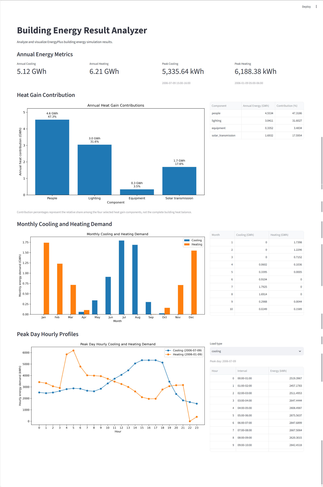

# Building Energy Result Analyzer

A Python-based analysis and visualization tool for EnergyPlus building simulation results.

The project processes EnergyPlus result data exported through Honeybee / Grasshopper workflows and converts large simulation datasets into clear energy metrics, charts, and an interactive Streamlit dashboard.

## Overview

Building simulation result files can contain millions of records and hundreds of output variables, making direct inspection difficult.

This project provides a reusable analysis workflow for extracting and organizing key building energy indicators, including:

- Annual cooling and heating demand
- Peak hourly cooling and heating demand
- Peak load time intervals
- Heat gain contribution analysis
- Monthly cooling and heating demand
- Peak-day hourly profiles
- Interactive result browsing with Streamlit
- Docker-based deployment

## Dashboard



## Project Background

This project is built from an architecture and building performance simulation workflow. The target use case is to process building energy simulation result files and convert them into clear indicators, charts, and reports.

Typical indicators may include:

- Cooling load
- Heating load
- Solar heat gain
- Lighting load
- Equipment load
- Indoor air temperature
- Monthly energy use
- Peak load time
- Baseline vs shading strategy comparison

## Current Status

Day 15: Project initialization.

The current version only includes the basic project structure. Data reading and analysis scripts will be added in the following days.

## Project Structure 

```text
building-energy-analyzer/
├── app.py                     # Streamlit dashboard
├── scripts/
│   ├── analyze_energy.py      # Data extraction, cleaning, and analysis
│   └── plot_energy.py         # Visualization and chart generation
├── data/                      # Raw EnergyPlus export files
├── output/                    # Generated CSV results and charts
├── docs/
│   └── images/                # README showcase images
├── Dockerfile                 # Docker image definition
├── .dockerignore
├── .gitignore
├── requirements.txt
└── README.md
```

## Analysis Workflow

The project separates data processing, visualization, and dashboard presentation into different stages:

```text
EnergyPlus / Honeybee / Grasshopper export
                ↓
     Excel workbook with SQL tables
                ↓
   ReportData + Dictionary + Time
                ↓
      Data extraction and cleaning
                ↓
   TimeIndex validation and repair
                ↓
     Hourly energy time series
                ↓
 Annual / monthly / peak-day metrics
                ↓
        CSV analysis results
                ↓
     Matplotlib chart generation
                ↓
       Streamlit Dashboard
```

`analyze_energy.py` handles data extraction, validation, time processing, and metric calculation.  
`plot_energy.py` reads structured analysis results and generates reusable charts.  
`app.py` focuses on result presentation and interaction without duplicating the core analysis logic.

## Key Analysis Results

Using the current EnergyPlus simulation dataset, the analyzer produced the following representative results:

| Metric | Result |
| --- | ---: |
| Annual cooling demand | 5.12 GWh |
| Annual heating demand | 6.21 GWh |
| Peak hourly cooling demand | 5,335.64 kWh |
| Cooling peak interval | 2006-07-09 15:00–16:00 |
| Peak hourly heating demand | 6,188.38 kWh |
| Heating peak interval | 2006-01-09 05:00–06:00 |
| Peak cooling month | July, 1.79 GWh |
| Peak heating month | January, 1.74 GWh |

## Features

- Read and validate EnergyPlus result data exported to Excel
- Extract key variables from large ReportData tables
- Repair and validate hourly time indices
- Calculate annual cooling and heating demand
- Identify peak hourly cooling and heating demand
- Analyze selected heat gain contributions
- Aggregate monthly cooling and heating demand
- Extract peak-day 24-hour profiles
- Generate reusable Matplotlib charts
- Present results in an interactive Streamlit dashboard
- Run the dashboard in a Docker container

## Running the Project

### 1. Install Dependencies

Create and activate a Python virtual environment, then install the required packages:

```bash
pip install -r requirements.txt
```

The main dependencies include pandas, openpyxl, matplotlib, and Streamlit.

### 2. Run the Energy Analysis

Place the local EnergyPlus export workbook in the project's `data/` directory, then run:

```bash
python scripts/analyze_energy.py
```

The analysis script reads the EnergyPlus result tables, validates and repairs time information, extracts key variables, calculates energy metrics, and generates structured CSV results in the `output/` directory.

Large raw simulation files are not included in this repository.

### 3. Generate Charts

After the analysis results have been generated, run:

```bash
python scripts/plot_energy.py
```

This creates reusable visualization files for:

- Heat gain contributions
- Monthly cooling and heating demand
- Peak-day hourly energy profiles

The generated charts are stored in the `output/` directory.

### 4. Run the Streamlit Dashboard

Start the dashboard with:

```bash
python -m streamlit run app.py
```

Then open:

```text
http://localhost:8501
```

The dashboard presents:

- Annual cooling and heating demand
- Peak hourly demand and time intervals
- Heat gain contributions
- Monthly cooling and heating demand
- Peak-day hourly profiles
- Interactive cooling / heating result browsing

### 5. Run with Docker

Build the Docker image:

```bash
docker build -t building-energy-dashboard .
```

Run the container:

```bash
docker run --rm -p 8501:8501 building-energy-dashboard
```

Then open:

```text
http://localhost:8501
```

The Docker image contains the Python environment, project code, Streamlit application, and the analysis results required by the dashboard.

Raw simulation files and large intermediate datasets are excluded from the Docker build context.

## Tech Stack

- Python 3.14
- pandas
- openpyxl
- matplotlib
- Streamlit
- Docker
- Git / GitHub
- EnergyPlus
- Honeybee
- Grasshopper

## Data Processing Notes

The current project is based on an EnergyPlus SQL result workbook exported through a Honeybee / Grasshopper workflow.

The original workbook contains multiple EnergyPlus result tables, including:

- `ReportData`
- `ReportDataDictionary`
- `Time`
- `TabularData`
- `Zones`
- `Surfaces`
- `Materials`
- `Constructions`

The three `ReportData` tables contain more than two million records in total.

Instead of loading every simulation variable into the final analysis workflow, the project first identifies relevant dictionary entries and extracts only the required EnergyPlus variables.

The time-processing workflow also validates EnergyPlus `TimeIndex` values before constructing the hourly time series. A missing hourly record discovered in the source `Time` table is explicitly identified and repaired before the final 8760-hour dataset is generated.

EnergyPlus hourly timestamps represent the end of each simulation interval. For example:

```text
2006-07-09 16:00
```

represents the interval:

```text
2006-07-09 15:00–16:00
```

This time convention is taken into account when reporting peak-load intervals and extracting complete peak-day profiles.

## Output Data

The analysis workflow currently generates structured results including:

```text
output/
├── basic_metrics.csv
├── energy_contribution.csv
├── monthly_energy.csv
├── peak_day_energy.csv
├── energy_contribution.png
├── monthly_energy.png
└── peak_day_energy.png
```

Generated outputs and large simulation files are excluded from Git version control.

The repository keeps only source code, documentation, configuration files, and selected showcase images.

## Interpretation Notes

The cooling and heating results currently use the following EnergyPlus Ideal Loads variables:

```text
Zone Ideal Loads Supply Air Total Cooling Energy
Zone Ideal Loads Supply Air Total Heating Energy
```

Therefore, the reported values represent building cooling and heating demand under the Ideal Loads system.

They should not be interpreted as actual HVAC electricity consumption.

The heat gain contribution analysis currently includes four selected components:

- People
- Lighting
- Electric equipment
- Window solar transmission

The reported percentages represent the relative shares among these four selected components only.

They do not represent a complete building heat balance or total building energy consumption.

## Current Scope

The current version focuses on processing and presenting results from a single EnergyPlus simulation dataset.

Implemented capabilities include:

- Large EnergyPlus result-table extraction
- Data validation and cleaning
- Hourly time-series reconstruction
- Annual energy metrics
- Peak-load identification
- Selected heat gain contribution analysis
- Monthly aggregation
- Peak-day profile extraction
- Matplotlib visualization
- Streamlit dashboard
- Docker deployment

## Planned Development

Future development will focus on extending the analyzer from single-case analysis to reusable simulation comparison workflows.

Planned directions include:

- Baseline vs. shading strategy comparison
- Multiple simulation case comparison
- Automatic Markdown report generation
- Automated interpretation of structured results
- Command-line interface
- AI-assisted report generation
- Integration with larger building-performance analysis workflows

## Project Purpose

This project is part of an ongoing exploration of combining architectural and building-performance knowledge with data analysis, software engineering, and AI-assisted workflows.

The goal is not only to visualize simulation outputs, but to gradually develop a reusable toolchain for turning complex building simulation data into structured, interpretable, and reproducible analysis results.
